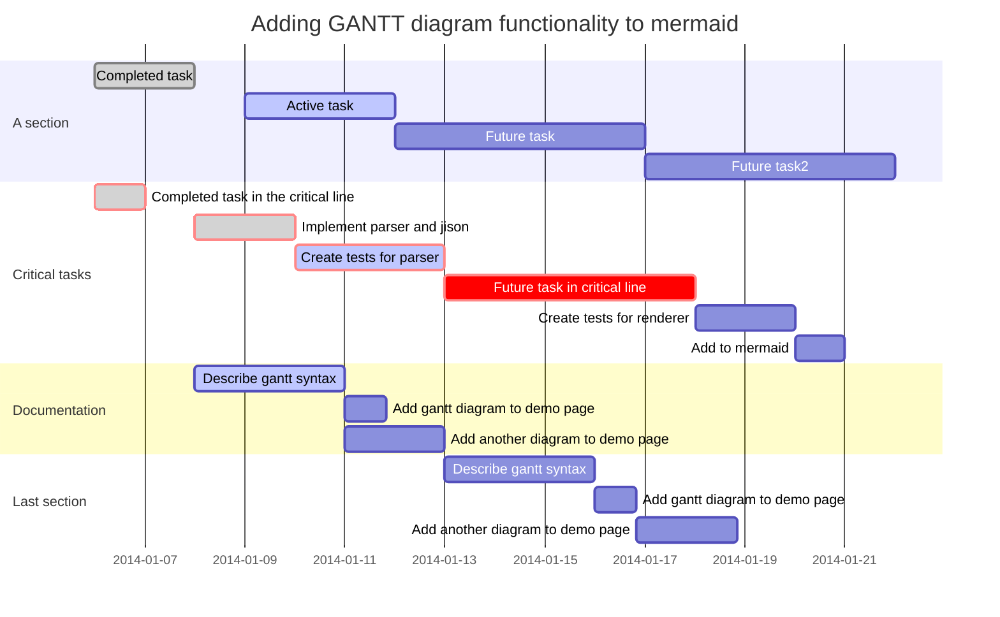

Section1. [데이터 정제]()

# Paragraph1. 데이터 결측값(Data Missing Value) 개념

- 결측값이란 입력이 누락된 값을 의미한다.
- 결측값은 NA, 999999, Null 등으로 표현한다.

# Paragraph2. 데이터 결측값 종류

1. 완전 무작위 결측(MCAR; Missing Completely At Random)
2. 무작위 결측(MAR; Missing At Random)
3. 비 무작위 결측(MNAR; Missing Not At Random)

# Paragraph3. 데이터 결측값 처리 절차

# Paragraph4. 데이터 결측값 처리 방법

## Subparagraph1. 단순 대치법

### Clause1. 단순 대치법(Single Imputation) 개념

### Cluase2. 단순 대치법의 종류

### Cluase3. 단순 확률 대치법의 종류

## Subparagraph2. 다중 대치법

### Clause1. 다중 대치법(Multiple Imputation) 개념

### Clause2. 다중 대치법 적용 방식